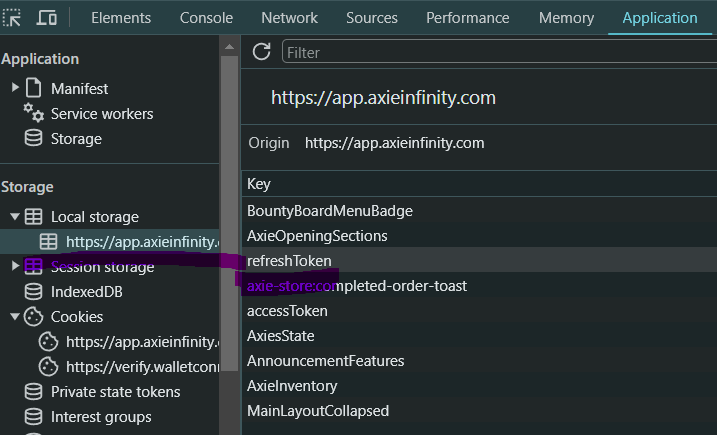

# Axie Infinity ethers tools

This repository provides a set of scripts to interact with Axies on the Ronin Network.

## How to use

Install the dependencies

```shell
npm install axie-ronin-ethers-js-tools ethers@5.7.0 dotenv
```

Create a wallet and provider with ethers, which will be used to interact with the Ronin Network

```typescript
import { ethers } from 'ethers';
import * as dotenv from 'dotenv'
dotenv.config()

// Connection to the Ronin network using the RPC endpoint
const connection = {
  url: 'https://api-gateway.skymavis.com/rpc',
  headers: {
      'x-api-key': 'xxxxx' // get from https://developers.skymavis.com/console/applications/
  }
}

// See https://docs.skymavis.com/api/rpc
const provider = new ethers.providers.JsonRpcProvider(connection);

// Import the wallet private key from the environment
const wallet = new ethers.Wallet(process.env.PRIVATE_KEY, provider) 
```

### Generate a marketplace access token, which is required to interact with the marketplace

Get it from https://app.axieinfinity.com/marketplace/ login and copy from the network tab using the browser developer tools  


### List an axie for sale on the marketplace

Full example here [examples/marketplace-js](https://github.com/alexx855/axie-ronin-ethers-js-tools/tree/main/examples/marketplace-js/sale.js)

```typescript
const createAxieSale = async () => {
  // 1 ETH in wei
  const basePrice = ethers.utils.parseUnits('1', 'ether').toString()
  // This is just for auctions
  const endedPrice = '0'
  // ID of the axie to list for sale on the marketplace
  const axieId = '9604431'
  // Generate marketplace access token (see above)
  const accessToken = await getMarketplaceAccessToken(wallet)
  // Get address from wallet
  const addressFrom = await wallet.getAddress()
  // Approve the axie contract to transfer axies from address to the marketplace contract
  const isApproved = await approveMarketplaceContract(addressFrom, wallet)
  // Get current block timestamp
  const currentBlock = await provider.getBlock('latest')
  const startedAt = currentBlock.timestamp
  const endedAt = 0 // 0 means no end time, use startedAt + duration for auctions
  // ~ 6 months default and max listing duration
  const expiredAt = startedAt + 15634800
  // Create the order
  const orderData = {
    address,
    axieId,
    basePrice,
    endedPrice,
    startedAt,
    endedAt,
    expiredAt,
  }
  // Wait for markeplace api result
  const skyMavisApiKey = 'xxxxx' // get from https://developers.skymavis.com/console/applications/
  const result = await createMarketplaceOrder(orderData, accessToken, wallet, skyMavisApiKey)
}
```

### Unlist an axie from the marketplace

Full example here [examples/marketplace-js](https://github.com/alexx855/axie-ronin-ethers-js-tools/tree/main/examples/marketplace-js/cancel.js)

```typescript
import { cancelMarketplaceOrder } from "axie-ronin-ethers-js-tools";

const cancelAxieSale = async (axieId: number) => {
    // Wait for the transaction to be mined
    const skyMavisApiKey = 'xxxxx' // get from https://developers.skymavis.com/console/applications/
    const receipt = await cancelMarketplaceOrder(axieId, wallet, skyMavisApiKey)
}

```

### Buy an axie

Full example here [examples/buy](https://github.com/alexx855/axie-ronin-ethers-js-tools/tree/main/examples/buy)

```typescript
import { buyMarketplaceOrder } from "axie-ronin-ethers-js-tools";

const buyAxieFromMarketplace = async (axieId: number) => {
  // Wait for the transaction to be mined
  const skyMavisApiKey = 'xxxxx' // get from https://developers.skymavis.com/console/applications/
  const receipt = await buyMarketplaceOrder(axieId, wallet, skyMavisApiKey)
  console.log(receipt.transactionHash)
}
```

### Batch transfer all axies in the account

Full example here [examples/batch-transfer-js](https://github.com/alexx855/axie-ronin-ethers-js-tools/tree/main/examples/batch-transfer-js)

This will transfer all axies from the wallet to the specified address, it uses the ERC721 Batch Transfer contract: <https://app.roninchain.com/address/0x2368dfed532842db89b470fde9fd584d48d4f644>

```typescript
import { getAxieIdsFromAccount, batchTransferAxies } from "axie-ronin-ethers-js-tools";

const batchTransferAllAxies = async (addressTo:string) => {
  // Get address from wallet
  const address: string = await wallet.getAddress()
  // get all axies ids from the account
  const axieIds: number[] = await getAxieIdsFromAccount(address, provider)
  // wait for tx to be mined and get receipt
  const receipt = await batchTransferAxies(wallet, addressTo, axieIds)
}

```

#### How to use locally

Clone this repository, copy `.env.example` to `.env` and fill in your account private key (you can get this from the Ronin wallet, or generate a new one). Then on the command line run:

```shell
npm install
npx hardhat account
npx hardhat refresh-access-token --token $REFRESH_TOKEN
npx hardhat list --axie $AXIE_ID --base-price 0.1
npx hardhat list --axie $AXIE_ID --base-price 0.1 --ended-price 0.2 --duration 1
npx hardhat list-all --base-price 0.1
npx hardhat list-all --base-price 0.1 --ended-price 0.2 --duration 1
npx hardhat unlist --axie $AXIE_ID
npx hardhat unlist-all
npx hardhat buy --axie $AXIE_ID
npx hardhat transfer-axie --axie $AXIE_ID --address $ADDRESS
npx hardhat transfer-all-axies --address $ADDRESS
npx hardhat transfer-all-axies --address $ADDRESS --axies "$AXIE_ID,$AXIE_ID"
```

#### Contributing

Feel free to open an issue or a pull request if you have any questions or suggestions.
